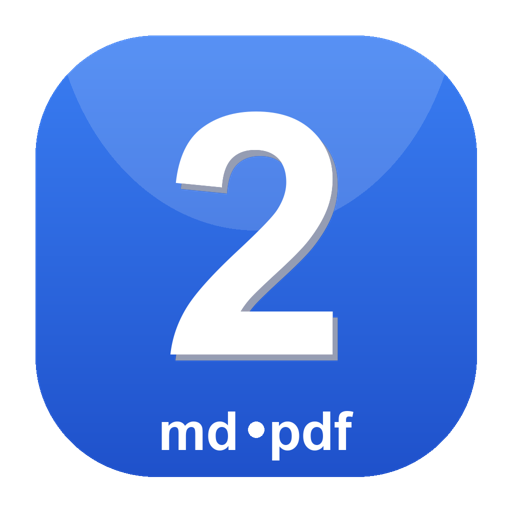

<p align="center">
  
</p>

<h1 align="center">md2pdf</h1>

<p align="center">A small, self-contained Markdown to PDF converter for macOS.</p>

A small, self-contained **Markdown -> PDF** converter for **macOS and Windows**,
written in Rust. It ships as both a simple desktop app and a command-line tool.
Fonts are embedded in the binary, so there are **no runtime dependencies** — no
system fonts, no headless browser, no LaTeX.

**Free and open source** (MIT licensed). Use it for anything you like, at no
cost. It is provided **as-is, with no warranty of any kind** — see
[Disclaimer](#disclaimer).

## Features

- Headings, **bold**, *italic*, `inline code`, and ~~strikethrough~~
- Fenced code blocks (monospace, framed) and inline code
- Ordered, unordered, and nested lists; task lists
- Blockquotes, horizontal rules, links (URL shown inline)
- Tables and image alt-text
- A4 / Letter / Legal paper sizes
- Automatic word-wrapping and page breaks

## The app (GUI)

Double-click **md2pdf.app**, then:

1. **Drag & drop** a Markdown file onto the window — or click **Browse…** to
   pick one.
2. **Output file name** — pre-filled with the source name and a `.pdf`
   extension; the PDF is written to the **same folder** as the source. Edit it
   if you like.
3. Pick a **paper size**, then **Convert to PDF**.

Use **Open PDF** / **Reveal in Finder** to jump straight to the result.

## The command-line tool

```sh
md2pdf input.md                 # → input.pdf (same folder)
md2pdf input.md -o report.pdf   # custom output
md2pdf README.md --paper letter --margin 18 --font-size 12
cat notes.md | md2pdf - -o notes.pdf   # read from stdin
```

Run `md2pdf --help` for all options.

## Installing

### Download a prebuilt release (no build needed)

Grab the latest `.dmg`, `.pkg`, or `.tar.gz` from the
[**Releases**](https://github.com/leondavi/md2pdf/releases) page. These are
built automatically as **universal** binaries (Apple Silicon + Intel) by GitHub
Actions.

### Disk image (easiest)

Open **`md2pdf-<version>-macos-<arch>.dmg`** and drag **md2pdf.app** onto the
**Applications** shortcut. The optional `cli/md2pdf` binary inside can be copied
to `/usr/local/bin` for command-line use.

### Installer package

Open **`dist/md2pdf-<version>.pkg`** and follow the prompts. It installs:

- `md2pdf.app` → `/Applications`
- `md2pdf` (CLI) → `/usr/local/bin`

### Portable archive (macOS)

Unpack `dist/md2pdf-<version>-macos-<arch>.tar.gz` and move `md2pdf.app` to
`/Applications` and `md2pdf` somewhere on your `PATH`.

> **Gatekeeper note:** the binaries are signed ad-hoc, not notarized. The first
> launch may need right-click → **Open** (app), or
> `xattr -dr com.apple.quarantine md2pdf.app` to clear the quarantine flag.

### Windows (x64)

Download and run **`md2pdf-<version>-windows-x64-setup.exe`** from the
[Releases](https://github.com/leondavi/md2pdf/releases) page. The installer adds
the **md2pdf** app (Start Menu / optional desktop shortcut) and can put the
`md2pdf` command-line tool on your `PATH`.

> Windows SmartScreen may warn because the installer is not code-signed; choose
> **More info → Run anyway**.

## Building from source

Requires a recent Rust toolchain.

```sh
cargo build --release            # builds both md2pdf and md2pdf-gui
cargo run --bin md2pdf -- file.md
cargo run --bin md2pdf-gui       # launch the GUI

# Package everything for macOS (app + .pkg + tarball → dist/):
packaging/build-macos.sh
```

To produce a universal (Apple Silicon + Intel) build, install both targets
first:

```sh
rustup target add aarch64-apple-darwin x86_64-apple-darwin
```

On **Windows**, build the binaries and package an installer with
[Inno Setup](https://jrsoftware.org/isinfo.php):

```bat
cargo build --release --target x86_64-pc-windows-msvc
iscc /DMyAppVersion=0.1.0 ^
     /DBinDir=%CD%\target\x86_64-pc-windows-msvc\release ^
     /DRepoDir=%CD% /DIconFile=%CD%\assets\logo.ico /DOutDir=%CD%\dist ^
     packaging\windows\md2pdf.iss
```

## Continuous integration & releases

Two GitHub Actions workflows live in [`.github/workflows`](.github/workflows):

- **`ci.yml`** — on every push and pull request, runs `cargo fmt --check`,
  `cargo clippy -D warnings`, `cargo build --release`, and `cargo test`.
- **`release.yml`** — on every pushed tag matching `v*` (e.g. `v0.1.0`), builds
  the universal macOS artifacts via `packaging/build-macos.sh` and publishes
  them to a GitHub Release. It can also be triggered manually from the Actions
  tab.

Cut a release by tagging a commit:

```sh
git tag v0.1.0
git push origin v0.1.0
```

## Project layout

| Path | Purpose |
| ---- | ------- |
| `src/lib.rs` | library root |
| `src/render.rs` | Markdown → PDF engine (pulldown-cmark → genpdf) |
| `src/bin/md2pdf.rs` | command-line tool |
| `src/bin/md2pdf-gui.rs` | egui desktop app |
| `assets/fonts/` | embedded DejaVu fonts |
| `assets/logo.*` | app icon / logo (png, ico) |
| `build.rs` | embeds the icon into the Windows executables |
| `packaging/` | macOS `.app`/`.pkg`/`.dmg` scripts + Windows Inno Setup script |

## Disclaimer

md2pdf is free, open-source software provided **"as is", without warranty of
any kind**, express or implied, including but not limited to the warranties of
merchantability, fitness for a particular purpose, and noninfringement. You use
it entirely at your own risk; the authors are not liable for any claim, damages,
or other liability arising from its use. See the [LICENSE](LICENSE) for the full
terms.

## Acknowledgements

md2pdf stands on great open-source work — see
[docs/ACKNOWLEDGEMENTS.md](docs/ACKNOWLEDGEMENTS.md) for the libraries, fonts,
and tools it uses, with their licenses.

## License

MIT — see [LICENSE](LICENSE). Bundles the DejaVu fonts (see
`assets/fonts/DejaVu-LICENSE.txt`). Third-party credits are in
[docs/ACKNOWLEDGEMENTS.md](docs/ACKNOWLEDGEMENTS.md).
